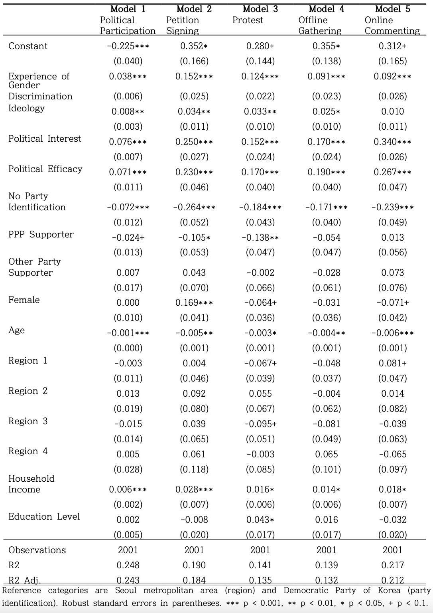

---

##### Abstract

Does the experience of gender discrimination mobilize unconventional political participation? Drawing on grievance theory and social identity theory, this study argues that individuals who have experienced gender discrimination are more likely to engage in unconventional forms of political action. Using data from a 2024 online survey, the analysis shows that experiences of gender discrimination are positively associated with all examined types of unconventional participation, including petition signing, protest, participation in political meetings, and online activism. Although no significant moderating effect of gender is detected, subgroup analyses by gender and generation reveal that the participatory effect of discrimination experiences is strongest not among women but among young men. Additional analyses of perceived life-course disadvantages indicate that young men report the highest levels of belief that men are disadvantaged across all stages of the life cycle. This pattern provides an indirect explanation for the particularly strong link between discrimination experiences and political participation among young men.

---

#### Main Results

---

#### Citation

An, Leesak Siwon Lee, and Sunkyoung Park. 2026. “Gender Discrimination Experience and Political Participation.” Journal of Contemporary Politics 19(1).